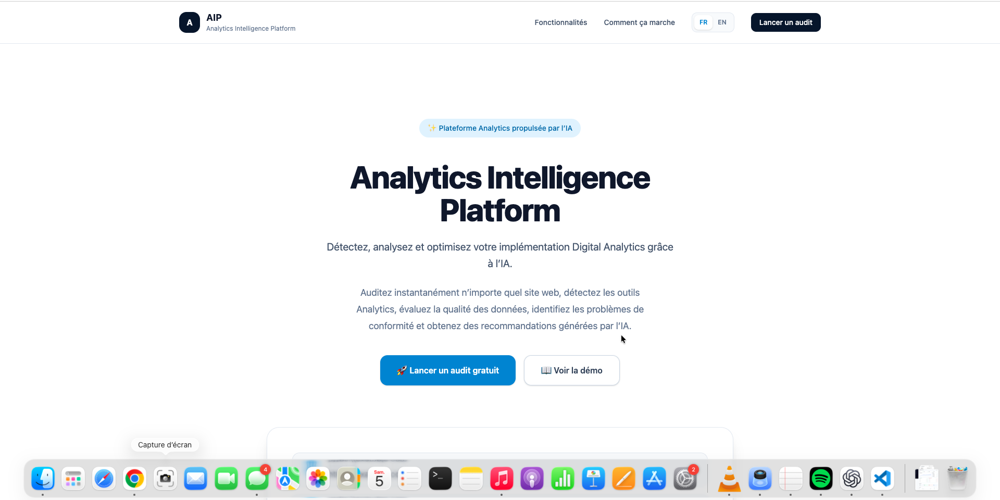
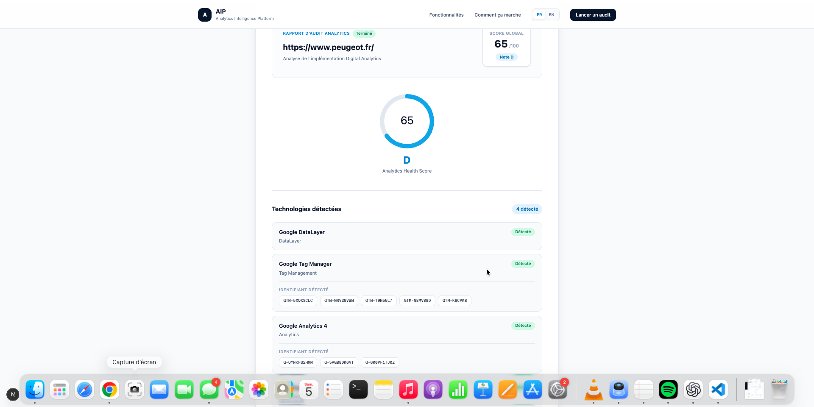

# 🚀 AIP — Analytics Intelligence Platform

> **AI-Powered Digital Analytics Audit Platform**

### Detect. Analyze. Score. Improve.

AIP is an automated Digital Analytics auditing platform designed to analyze a website's analytics ecosystem from a simple URL.

It combines **static analysis, browser-based runtime inspection, deterministic detection and scoring engines, and Generative AI** to transform technical signals into a structured Digital Analytics audit.

> **Deterministic engines establish the evidence. AI transforms that evidence into an actionable audit report.**

---

## 🌍 Live Application

AIP is deployed on Vercel:

**https://agent-ia-lilac.vercel.app/**

---

## 🎯 Project Goal

Digital Analytics audits often require analysts to manually inspect multiple technical layers:

- website source code;
- analytics implementations;
- Tag Management Systems;
- Consent Management Platforms;
- advertising pixels;
- DataLayer structures;
- JavaScript runtime behavior;
- network requests;
- dynamically loaded tags;
- tracking identifiers;
- data quality and implementation maturity.

Modern tracking architectures make this increasingly complex because technologies may be loaded dynamically through GTM, CMPs, JavaScript execution, consent mechanisms or other runtime processes.

AIP automates a significant part of this technical pre-audit workflow.

---

## 💡 How AIP Works

AIP V3.1 combines **static analysis and browser-based dynamic analysis**.

```text
Website URL
     │
     ├──────────────────────┐
     │                      │
     ▼                      ▼
Static Analysis       Browser Engine
HTML / Scripts      Playwright + Chromium
     │                      │
     │               ┌──────┼───────────┐
     │               ▼      ▼           ▼
     │          Rendered   Network    Runtime
     │             DOM     Requests   Signals
     │                                DataLayer
     │               └──────┬───────────┘
     │                      │
     └──────────┬───────────┘
                ▼
          Evidence Fusion
                │
                ▼
         Detection Engine
                │
                ▼
         Knowledge Engine
                │
                ▼
          Scoring Engine
                │
                ▼
          AI Report Engine
                │
                ▼
       Structured Audit
```

This architecture separates **technical evidence collection** from **AI interpretation**.

The AI model does not decide whether a technology exists and does not calculate the audit score.

---

# ✨ Key Capabilities

## 🔍 Static Technology Detection

AIP analyzes HTML, scripts and observable technical signals to detect supported Digital Analytics technologies.

### Analytics

- Google Analytics 4
- Adobe Analytics
- Piano Analytics
- Eulerian Analytics

### Tag Management

- Google Tag Manager
- Adobe Experience Platform Launch
- TagCommander

### Consent Management

- Didomi
- OneTrust
- Axeptio
- Cookiebot
- generic consent signals

### Advertising & Marketing

- Meta Pixel
- LinkedIn Insight Tag
- TikTok Pixel
- Floodlight

### Data Architecture

- Google DataLayer
- DataLayer events
- standard variables
- e-commerce structures
- consent signals

Detection results can include:

- technology;
- vendor;
- category;
- detected identifiers;
- technical evidence;
- detection source;
- confidence level;
- implementation details.

---

# 🌐 Playwright Browser Engine — V3.1

AIP V3.1 introduces a **real browser analysis layer powered by Playwright and Chromium**.

Static HTML inspection alone cannot reliably observe technologies that appear only after JavaScript execution.

The Browser Engine allows AIP to inspect the website after runtime execution.

It can collect evidence from:

- rendered DOM;
- dynamically loaded scripts;
- browser network activity;
- JavaScript runtime;
- DataLayer;
- runtime variables;
- analytics identifiers;
- dynamically loaded technologies.

This significantly increases detection coverage compared with static-only analysis.

---

## 🔎 Dynamic Evidence Engine

Runtime signals collected by the Browser Engine are transformed into structured evidence.

AIP can analyze:

```text
Rendered DOM
     +
Loaded Scripts
     +
Network Requests
     +
Runtime Variables
     +
DataLayer
     +
Analytics Identifiers
```

Dynamic evidence is then normalized before being sent to the Detection Engine.

---

## 🔄 Static + Dynamic Evidence Fusion

AIP combines static and runtime evidence instead of treating them as separate audits.

```text
Static Evidence
       +
Dynamic Evidence
       ↓
Evidence Fusion
       ↓
Deduplication
       ↓
Detection Engine
```

Duplicate technologies and identifiers are merged to produce a unified detection result.

This allows AIP to preserve the speed and deterministic nature of static analysis while gaining deeper runtime visibility.

---

# 🛡️ Browser Security

Running a browser against user-provided URLs introduces security risks.

AIP V3.1 therefore includes SSRF protection for browser-based analysis.

The security layer prevents access to:

- localhost;
- private IP addresses;
- internal network ranges;
- unsafe DNS resolutions;
- prohibited redirects;
- unsafe browser subrequests.

Browser navigation and network activity are validated before requests are allowed.

This makes the Browser Engine more suitable for controlled server-side execution.

---

# 🔁 Resilient Audit Pipeline

Browser automation can fail because of:

- Chromium startup problems;
- website protections;
- network errors;
- timeouts;
- browser incompatibilities.

AIP therefore implements automatic fallback behavior.

```text
Browser Engine available
        │
       YES
        ↓
Static + Dynamic Audit

Browser Engine unavailable
        │
       YES
        ↓
Static V2 Audit
```

A Chromium failure does not automatically prevent AIP from producing an audit.

---

# 🧠 Knowledge Engine

Technology detection alone is not sufficient for a Digital Analytics audit.

The **Knowledge Engine** applies deterministic Digital Analytics rules to detected evidence.

It can identify situations such as:

- GTM detected without directly visible GA4;
- GA4 implemented directly without GTM;
- GTM detected without an identifiable DataLayer;
- multiple Tag Management Systems;
- multiple GTM containers;
- advertising technologies without an identifiable CMP;
- implementations requiring additional verification.

Example:

```text
GTM detected
+
GA4 not visible in static HTML
        ↓
Knowledge Engine
        ↓
GA4 may be configured through GTM
        ↓
Runtime verification
```

V3.1 can now perform part of that runtime verification directly through the Browser Engine.

---

# 📊 Deterministic Scoring Engine

AIP evaluates Digital Analytics maturity across five categories.

| Category | Maximum Score |
|---|---:|
| Analytics | 20 |
| Tag Management | 20 |
| Consent | 20 |
| Marketing | 20 |
| Data Quality | 20 |
| **Global Score** | **100** |

The scoring system is **deterministic and rule-based**.

The AI model does not calculate the score.

Identical evidence therefore produces consistent scoring results.

---

# 🗂️ DataLayer Intelligence

AIP analyzes observable DataLayer structures and signals.

Supported analysis includes:

- `window.dataLayer`;
- `dataLayer.push()`;
- GTM internal events;
- business events;
- navigation variables;
- user variables;
- commerce variables;
- e-commerce structures;
- forms;
- search signals;
- consent-related signals.

Example:

```text
Navigation
├── page_name
├── page_type
├── page_category
└── page_location

User
├── user_id
├── user_status
└── login_status

Commerce
├── currency
├── value
└── transaction_id

E-commerce
├── ecommerce
├── items
├── item_id
├── item_name
├── quantity
└── price
```

V3.1 can inspect both statically observable DataLayer evidence and runtime DataLayer state.

---

# 🤖 AI Report Engine

After evidence collection, detection, knowledge analysis and scoring, the **AI Report Engine** transforms structured findings into a professional audit.

Reports can include:

- Executive Summary;
- Strengths;
- Weaknesses;
- Recommendations;
- Priority Actions;
- Technical Analysis.

Reports can currently be generated in:

- 🇫🇷 French
- 🇬🇧 English

The AI receives structured evidence generated by the previous engines.

It is not responsible for technology detection or scoring.

---

# ⚠️ Evidence-Based Detection

One of AIP's core principles is:

> **Not detected does not mean absent.**

AIP distinguishes between:

```text
Technology confirmed
        ≠
Technology not detected
        ≠
Technology confirmed absent
```

Even browser-based analysis cannot guarantee complete visibility.

Technologies may depend on:

- specific consent interactions;
- authentication;
- particular user journeys;
- server-side tracking;
- first-party proxy architectures;
- geographic conditions;
- anti-bot protections.

When evidence is insufficient, AIP communicates uncertainty rather than inventing a conclusion.

---

# 🧪 Static vs Dynamic Analysis — Real Validation Case

The Browser Engine was validated against real-world analytics implementations.

One representative test demonstrated the difference between static-only and runtime analysis.

### Static analysis

```text
DataLayer detected

Global score: 5/100
```

### V3.1 browser analysis

```text
DataLayer
+
Google Tag Manager
+
Google Analytics 4
+
Floodlight

5 GTM containers detected
3 GA4 identifiers detected
```

The test demonstrates why runtime inspection is important for modern analytics architectures.

Technologies configured through tag managers or dynamically loaded scripts may not be observable from initial HTML alone.

---

# 🏗️ AIP V3.1 Architecture

```text
                    AIP V3.1
          Analytics Intelligence Platform
                         │
                         ▼
                   Website URL
                         │
              ┌──────────┴──────────┐
              ▼                     ▼
        HTML Fetcher          Browser Engine
                                  │
                              Playwright
                                  │
                               Chromium
                                  │
                       ┌──────────┼──────────┐
                       ▼          ▼          ▼
                     DOM       Network    Runtime
                                             │
                                         DataLayer
              │                     │
              └──────────┬──────────┘
                         ▼
                  Evidence Engine
                         │
                         ▼
                  Detection Engine
                         │
                         ▼
                  Knowledge Engine
                         │
                         ▼
                   Scoring Engine
                         │
                         ▼
                  AI Report Engine
                         │
                         ▼
                   Audit Interface
```

---

# 🔌 API

Main audit endpoint:

```text
POST /api/agent
```

Example:

```bash
curl -X POST http://localhost:3000/api/agent \
  -H "Content-Type: application/json" \
  -d '{
    "url": "https://example.com",
    "language": "fr"
  }'
```

The API orchestrates the complete audit pipeline.

---

# 📸 Product Preview

## AIP Interface

AIP provides a simple interface allowing a user to launch a Digital Analytics audit from a website URL.



## Detection & Scoring

Example of a Digital Analytics audit performed on Peugeot France using the AIP V3.1 Browser Intelligence Engine.

The runtime analysis detects technologies and identifiers that may not be observable through static HTML analysis alone.



---

# 🧪 Quality Assurance

AIP has been tested against multiple real-world websites representing different Analytics architectures.

QA scenarios include:

- Google Tag Manager;
- Google Analytics 4;
- Adobe Analytics;
- DataLayer implementations;
- Consent Management Platforms;
- advertising pixels;
- Floodlight;
- dynamically loaded technologies;
- websites with limited static evidence;
- anti-bot infrastructure.

V3.1 additionally validates:

- Chromium execution;
- rendered DOM capture;
- network inspection;
- runtime evidence;
- DataLayer runtime inspection;
- static/dynamic evidence fusion;
- fallback behavior;
- SSRF protections.

---

# ⚠️ Current Limitations

AIP V3.1 provides significantly deeper visibility than static-only analysis, but it remains an automated technical pre-audit.

### Consent interactions

Some technologies require specific consent actions before loading.

### Complex user journeys

Tags triggered only after login, checkout, forms or specific navigation paths may require scenario-based browser automation.

### Server-side tracking

Server-side or proxy-based implementations may expose limited browser evidence.

### Anti-bot protection

Some websites can restrict automated browser execution.

### Technology coverage

AIP can formally identify technologies currently supported by its Detection Engine.

These limitations are treated as **uncertainty**, not proof of absence.

---

# 🛠️ Tech Stack

### Frontend

- Next.js 16
- React
- TypeScript
- Tailwind CSS

### Analytics Engine

- Modular Detection Engine
- Dynamic Evidence Engine
- Knowledge Engine
- Deterministic Scoring Engine
- DataLayer Analysis

### Browser Automation

- Playwright
- Chromium
- Network inspection
- Runtime JavaScript analysis

### Artificial Intelligence

- OpenAI API

### Security

- SSRF protection
- DNS validation
- redirect validation
- private-network blocking

### Development & Deployment

- Git
- GitHub
- Vercel

---

# 📂 Project Structure

```text
agent-ia/
│
├── app/
│   ├── api/
│   │   └── agent/
│   ├── audit/
│   └── page.tsx
│
├── components/
│
├── lib/
│   ├── detectors/
│   ├── knowledge/
│   ├── scoring/
│   ├── report/
│   ├── orchestrator/
│   ├── browser/
│   ├── security/
│   └── ai/
│
├── docs/
│   └── screenshots/
│       ├── aip-home.png
│       └── aip-audit-peugeot.png
│
├── public/
├── package.json
└── README.md
```

The exact internal structure may evolve as the Browser Engine is consolidated.

---

# 🚀 Local Development

## 1. Clone

```bash
git clone https://github.com/Bricegoye/agent-ia.git
cd agent-ia
```

## 2. Install dependencies

```bash
npm install
```

Playwright/Chromium dependencies may also be required for browser-based analysis.

## 3. Environment

Create:

```text
.env.local
```

Configure the required environment variables, including the OpenAI API key where applicable.

Never commit API keys or secrets.

## 4. Development

```bash
npm run dev
```

Open:

```text
http://localhost:3000
```

Audit interface:

```text
http://localhost:3000/audit
```

## 5. Production validation

```bash
npm run build
```

---

# 🧬 Project Evolution

## ✅ V1 — Proof of Concept

```text
URL
 ↓
HTML
 ↓
Basic Detection
 ↓
OpenAI
 ↓
Audit
```

Validated the initial concept of automated Digital Analytics auditing.

---

## ✅ V2 — Analytics Intelligence Engine

Introduced the deterministic intelligence architecture:

```text
Detection
    ↓
Knowledge
    ↓
Scoring
    ↓
AI Reporting
```

Major additions:

- modular detectors;
- structured technical evidence;
- Knowledge Engine;
- deterministic scoring;
- DataLayer analysis;
- AI Report Engine;
- FR/EN reports;
- centralized HTML Fetcher;
- redesigned audit interface;
- real-world QA.

---

## 🚧 V3.1 — Browser Intelligence Engine

Introduces runtime website inspection.

### Implemented

- Playwright 1.62.1;
- Chromium browser execution;
- rendered DOM analysis;
- dynamic script inspection;
- network request inspection;
- request status tracking;
- runtime JavaScript signals;
- runtime DataLayer inspection;
- Dynamic Evidence Engine;
- static + dynamic evidence fusion;
- deduplication;
- integration with Detection Engine;
- automatic V2 fallback;
- SSRF protection;
- DNS/private-network protection;
- redirect and browser-subrequest protection.

V3.1 transforms AIP from a primarily static analyzer into a **hybrid static + browser-based Analytics Intelligence Platform**.

---

# 🔮 Roadmap

## V3.x — Browser Intelligence Expansion

Planned improvements include:

- deeper consent interaction scenarios;
- multi-page browser journeys;
- richer network classification;
- enhanced runtime DataLayer intelligence;
- additional analytics/CMP detection;
- browser execution diagnostics.

## V4 — Advanced Audit Intelligence

Potential capabilities:

- audit history;
- audit comparison;
- advanced maturity scoring;
- tagging plan generation;
- PDF audit reports;
- client/project management;
- governance analysis;
- advanced recommendations.

---

# 🌟 Long-Term Vision

The objective is to allow a Digital Analytics professional to enter:

```text
https://www.client.com
```

and obtain:

```text
Static Analysis
        +
Runtime Browser Analysis
        +
Technology Detection
        +
Analytics Architecture
        +
Tag Management
        +
Consent
        +
Marketing Pixels
        +
DataLayer Quality
        +
Analytics Maturity Score
        +
Prioritized Recommendations
        +
Professional Audit Report
```

AIP is not designed to replace a Digital Analytics consultant.

It is designed to automate repetitive technical pre-audit work so analysts can focus on higher-value activities:

- measurement strategy;
- analytics architecture;
- data quality;
- governance;
- business requirements;
- optimization.

---

# 💡 Engineering Principles

### Evidence before assumptions

Technical conclusions should be supported by observable evidence.

### Static + runtime evidence

Modern analytics implementations require both source-level and browser-level inspection.

### Deterministic logic before AI

Detection and scoring should remain predictable and testable.

### AI as an intelligence layer

Generative AI interprets structured findings rather than inventing technical evidence.

### Explicit uncertainty

When AIP cannot prove something, it should communicate uncertainty.

### Security by design

Browser automation must prevent access to unsafe or internal network resources.

### Graceful degradation

Failure of the Browser Engine should not automatically prevent the static audit from running.

---

# 📌 Project Status

```text
AIP V1 — Proof of Concept                 ✅

AIP V2 — Analytics Intelligence Engine
├── Detection Engine                      ✅
├── Knowledge Engine                      ✅
├── Scoring Engine                        ✅
├── DataLayer Analysis                    ✅
├── AI Report Engine                      ✅
└── Audit Interface                       ✅

AIP V3.1 — Browser Intelligence Engine
├── Playwright / Chromium                 ✅
├── Rendered DOM                          ✅
├── Network Inspection                    ✅
├── Runtime Signals                       ✅
├── Dynamic DataLayer                     ✅
├── Dynamic Evidence Engine               ✅
├── Static + Dynamic Fusion               ✅
├── V2 Automatic Fallback                 ✅
└── SSRF / Network Protection             ✅

Advanced Browser Intelligence             🚧
```

---

# 👨‍💻 Author

**Brice Goye**

**Senior Digital Analytics & AI/Data Solutions Engineer**

AIP is a personal engineering project exploring the intersection of:

- Digital Analytics;
- Analytics Engineering;
- browser automation;
- automated auditing;
- data quality;
- deterministic rule systems;
- Generative AI;
- modern web engineering.

---